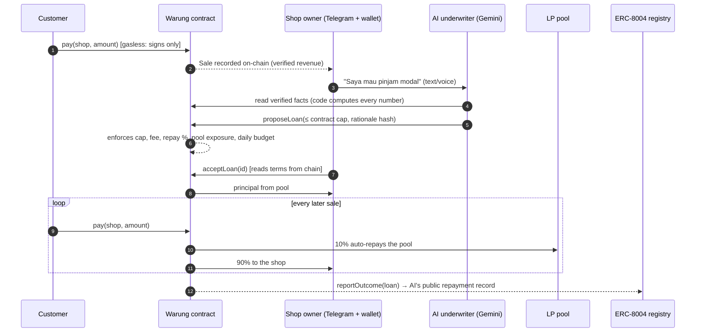
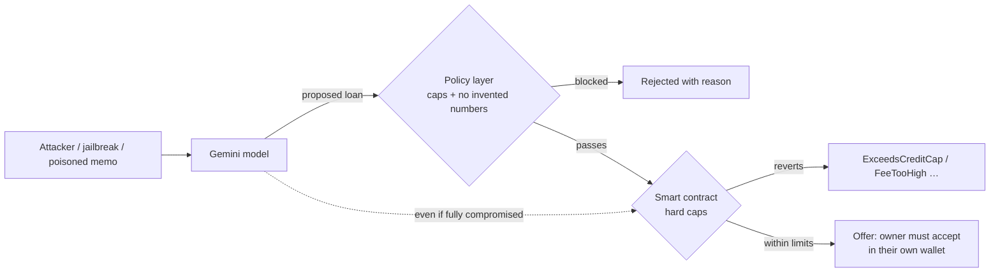

# 🏪 Warung Agent

**Fair credit for Indonesia's 64 million small shops. The AI proposes, the smart contract decides.**

Built for **Indonesia Web3 Hackathon 2026** on **BNB Smart Chain** · Tracks: **AI Agents · Finance & Commerce · Consumer Apps**

> Live demo: **https://warung-agent.vercel.app** · Try to break the AI: **https://warung-agent.vercel.app/redteam** · Telegram bot: **[@WarungAgenttBot](https://t.me/WarungAgenttBot)** · Demo video: **`<VIDEO_URL>`**

---

## The problem

Most Indonesian *warung* owners and small sellers (UMKM) have no formal credit history, because they have no records a bank can trust. When they need working capital they turn to *pinjol* (predatory online lenders) or loan sharks. Banks won't lend, because the shop can't prove its sales.

## The solution

Warung Agent turns everyday QR payments into a **tamper-proof, shop-owned revenue record on-chain**, then uses an AI underwriter to offer **collateral-free micro-loans from a public pool**. The loan is repaid **automatically as a small share of each sale**, enforced by the smart contract. There are no due dates, no penalties and no debt collectors.

1. **Sell:** customers scan a QR and pay in an IDR stablecoin. Every payment is recorded on-chain.
2. **Get an offer:** the owner chats with the AI in Bahasa on Telegram (text or voice). The AI reads the verified sales and proposes terms.
3. **Accept:** the owner accepts in their own wallet. The terms shown are read **from the contract**, not from chat.
4. **Repay by selling:** each sale sends a small share to the pool. A slow week just means slower repayment.
5. **Build a record:** the shop's tier rises, and the AI's own repayment record is published on-chain (ERC-8004).

Lenders are anyone holding stablecoins: they deposit into the public pool and earn the loan fees. Every loan and repayment is public.



## Why the AI can't hurt anyone

LLMs hallucinate and can be jailbroken, so **nothing the AI says is trusted**. Safety does not depend on the model behaving. There are four independent layers:

| # | Layer | What it stops | Where |
|---|---|---|---|
| 1 | **The AI's key can only call `proposeLoan`** and holds no funds | The AI moving money | `UNDERWRITER_ROLE`, [Warung.sol](contracts/src/Warung.sol) |
| 2 | **Hard caps in the contract:** loan ≤ 10% of trailing verified revenue and ≤ tier max; fee ≤ 5%; ≤ 20% of each sale; per-loan ≤ 5% of pool; daily budget; ≥ 5 distinct customers; per-customer revenue cap | Over-lending, even if the AI is fully compromised | `Warung.sol` reverts (`ExceedsCreditCap`, `FeeTooHigh`…) |
| 3 | **The LLM never writes numbers.** Its explanation is a template with `{{placeholders}}`; code fills in real figures. Any stray digit rejects the proposal | Hallucinated figures reaching the owner | [policy.ts](app/server/policy.ts) |
| 4 | **Reply guard:** every figure in the AI's final message must already appear in a tool result, otherwise the model must rewrite | The AI inventing or miscalculating numbers in chat | [agent.ts](app/server/agent.ts) |
| + | **Consent comes from the chain:** the accept page shows terms read from the contract. The merchant is fixed by code, so no tool lets the model retarget a loan | Misleading chat text, prompt-injected retargeting | [app/loan/[id]](app/app/loan/%5Bid%5D/page.tsx) |

**Attack it yourself:** [`/redteam`](https://warung-agent.vercel.app/redteam) lets you jailbreak the AI, poison a payment memo, or even assume the model is *fully compromised* and hand its raw tool call to the safety layers. You can also turn the off-chain policy layer off and watch the **contract alone** revert with `ExceedsCreditCap`. It only ever *simulates* against the real contract and never sends a transaction.



## Why it needs web3

| Piece | Why it must be on-chain |
|---|---|
| IDR stablecoin payments | A near-zero-fee rail where sales are *natively* visible to lenders |
| `Sale` events | A revenue history the **shop owns** and any lender can verify, with no bank gatekeeper |
| Auto-repayment split | Repayment enforced by code instead of collectors |
| Permissionless pool | Anyone can fund local shops; every loan and repayment is public |
| ERC-8004 agent identity + reputation | The AI underwriter has a **public, unforgeable track record** (the registry rejects self-reviews, so only real loan outcomes count) |

## Gasless for users

Owners and customers **never need BNB**. They sign EIP-712 messages (`registerFor`, `payFor`, `acceptLoanFor`) and a relayer submits them. The contract only moves value to exactly what the user signed for, so a relayer can delay or drop a message but can never alter, redirect or replay it (tested). The relayer key is separate from the AI key and holds only gas money. BNB Chain's MegaFuel paymaster is the production path; its testnet sponsor policies need NodeReal approval.

## Deployed contracts (BNB Smart Chain **testnet**, chain id 97)

| Contract | Address |
|---|---|
| **Warung** | [`0xF6fD0727D20eD76442BfD16727fA4ce1482321D8`](https://testnet.bscscan.com/address/0xF6fD0727D20eD76442BfD16727fA4ce1482321D8) |
| MockIDRX (testnet stand-in for IDRX, 2 decimals) | [`0x6CD5aDaA626A96F88a3577aEa22c540Cdc99e527`](https://testnet.bscscan.com/address/0x6CD5aDaA626A96F88a3577aEa22c540Cdc99e527) |
| ReputationAdapter (posts loan outcomes to ERC-8004) | [`0x41dA930a8712A2799F3B87d7E6A29f6195C5214E`](https://testnet.bscscan.com/address/0x41dA930a8712A2799F3B87d7E6A29f6195C5214E) |
| AI underwriter wallet (owner of ERC-8004 agent **#2535**) | [`0xA13B769d9b9777d49f73491379007dc4C2A1dc78`](https://testnet.bscscan.com/address/0xA13B769d9b9777d49f73491379007dc4C2A1dc78) |
| Demo shop "Warung Bu Sri" | [`0x7FeaeE8CFcC8D0E79329A864Fcf9758F4DDd98C6`](https://testnet.bscscan.com/address/0x7FeaeE8CFcC8D0E79329A864Fcf9758F4DDd98C6) |
| ERC-8004 Identity / Reputation registries (BNB testnet) | `0x8004A818BFB912233c491871b3d84c89A494BD9e` / `0x8004B663056A597Dffe9eCcC1965A193B7388713` |

A complete real loan cycle has been run on-chain: the AI proposed Rp 800.000, the shop accepted, 50 customers' payments auto-repaid it, the loan closed, and the AI's ERC-8004 record now reads **1 loan, 100/100**.

## Repository layout

```
contracts/   Foundry. Warung.sol (credit + pool + relayed actions), ReputationAdapter.sol, MockIDRX.sol
             33 tests: unit, fuzz, stateful invariants, relay attack cases
app/         ONE Next.js project, deployed on Vercel
  app/         pages: owner dashboard (/dashboard), public shop page, QR pay, loan acceptance, LP pool, AI identity, /redteam
  app/api/     serverless routes: agent, sales, relay (gasless), auth + chat (wallet sign-in), link, redteam, telegram (webhook)
  server/      Gemini agent + policy layer + reply guard, relayer, keeper, Redis store, Telegram handlers
               10 policy tests (npm test)
  scripts/     seed the demo shop, run a full loan cycle, gasless end-to-end test
```

## Run it yourself

Prerequisites: Node 22+, [Foundry](https://getfoundry.sh), a BSC testnet wallet with tBNB, a [Gemini API key](https://aistudio.google.com/apikey) (free tier), a Telegram bot token from @BotFather. Redis is optional locally (it falls back to memory).

```bash
git clone --recurse-submodules https://github.com/ketutezraugm/warung-agent && cd warung-agent

# 1. contracts
cd contracts
cp .env.example .env              # PRIVATE_KEY (throwaway testnet wallet), AGENT_ADDRESS
forge test                        # 33 tests
bash redeploy.sh                  # deploy → adapter → seed demo shop → one real loan cycle (writes app/.env.local)

# 2. app + API + bot
cd ../app && npm install
cp .env.example .env.local        # add the server-side keys listed in DEPLOY.md
npm test                          # policy tests
npm run dev                       # http://localhost:3000 (API under /api)
```

Hosting on Vercel (webhook, Redis, env vars): see [DEPLOY.md](DEPLOY.md). Useful scripts (`app/`): `npm run seed -- day` (record a day of demo sales; run daily to keep the 30-day credit window fresh), `npm run e2e` (full loan cycle on testnet), `npm run gasless` (zero-BNB wallet pays and registers via the relayer, plus tamper/replay attacks), `npm run warm` (backfill the sale-history cache).

## Roadmap: paying with QRIS (OVO, GoPay, Dana, bank apps)

Today's payment QR opens a payment page and settles in a stablecoin, so **OVO/GoPay/bank apps can't scan it** (they only read QRIS, which settles in rupiah). We say so on the pay page too. Try it without any wallet: the pay page has a **demo wallet** button that funds a throwaway testnet wallet and pays gaslessly.

The production path keeps everything on-chain as is and changes only how money enters:

1. The shop shows a **QRIS** code issued by a licensed payment provider.
2. A customer pays with their usual e-wallet, in rupiah.
3. The provider converts and settles **IDRX** (rupiah stablecoin on BNB Chain, which already has rupiah on/off-ramps) straight into the Warung contract via `pay`, which records the sale and takes the repayment share.

The contract, the verified revenue record, the AI underwriter and its limits are unchanged. This needs a licensed QRIS partner, so it is deliberately out of scope for the hackathon build.

## Honest limits

- **Testnet only.** The stablecoin is a mock. There is no real money, the demo shop's customers are seeded wallets, and the payment QR is a link, not QRIS (see the roadmap above). We had no access to real UMKM during the hackathon.
- **Real lending needs a license.** The production path is partnering with an OJK-licensed P2P lender or *koperasi* as lender of record (OJK regulatory sandbox), with real IDRX.
- **Demo wash-trading defense is parameter-based:** a per-customer daily cap, a minimum payment and ≥ 5 distinct customers per loan, plus the AI's fraud flag, which can only *lower* limits. A production system would add identity and device attestation.
- Custom fixed parameters (no admin setter or timelock); (see `ponytail:` comments in code for upgrade paths). State (wallet links, rate limits, locks) lives in Upstash Redis.

## Tech

Solidity 0.8.28 · Foundry · OpenZeppelin 5 · ERC-8004 · EIP-712 / EIP-2612 · viem · Google Gemini (free tier) · grammY (Telegram webhook) · Next.js on Vercel · Upstash Redis · BNB Smart Chain testnet

## License

MIT
