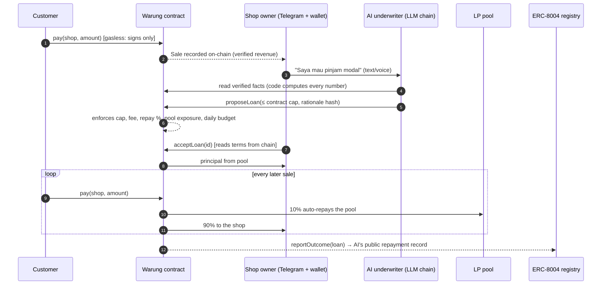
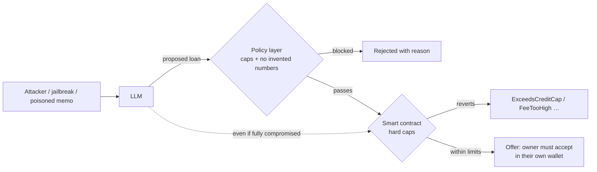

# Submission form: ready-to-paste fields

Network: BNB Smart Chain Testnet (chain id 97).

## 1. Contract Address

```
0xF6fD0727D20eD76442BfD16727fA4ce1482321D8
```

## 2. Problem Statement

Indonesia has around 64 million small shops (UMKM). They sell every day, but their income lives in cash and notebooks, so no bank or lender can verify it. When they need money to restock, they turn to pinjol: predatory online lending apps with interest that keeps growing, debt collectors who call the borrower's family, and access to the phone's contacts. Their real asset, a steady record of daily sales, is invisible to fair lenders. It matters because working capital is the difference between a shop that grows and one that stays stuck, and the only credit within reach today does harm.

## 3. Solution

Kulaya turns every QR sale into a tamper-proof sales record on BNB Chain that the shop owns. That record becomes a credit limit (10% of verified 30-day sales, capped by the shop's level). An AI underwriter, with an ERC-8004 on-chain identity, reads the verified sales and offers a small collateral-free loan. The owner sees the exact terms, read from the smart contract and not from chat, and accepts with one free signature. The loan then repays itself automatically as a share of each sale: no due date, no late fees, no collectors, a flat fee written up front.

The AI can only propose. Its key holds no funds and can call one function. Hard caps in the contract (loan size, fee, repayment share, pool exposure, daily budget, at least 5 different customers) decide what is allowed, so even a jailbroken AI cannot lend outside the rules. You can attack it live on the red-team console and watch the contract reject it.

Owners and customers never pay network fees (gasless, signatures only). The owner app is Bahasa-first and works on a phone, with a Telegram bot that takes voice notes.

## 4. Project Detail

````markdown
# Kulaya: credit that grows from every sale

*Modal usaha, dari hasil jualan sendiri.* AI micro-credit for Indonesia's small shops, enforced by a smart contract on BNB Chain. **The AI proposes. The contract decides.**

| | |
|---|---|
| Live app (owner site, Bahasa) | https://kulaya.vercel.app |
| Judge / developer site (English) | https://kulaya.vercel.app/protocol |
| Try to break the AI | https://kulaya.vercel.app/protocol/redteam |
| Demo video (3 min) | https://youtu.be/mTLAuLq-RCg |
| Source code | https://github.com/ketutezraugm/kulaya |
| Telegram bot | https://t.me/KulayaBot |
| Core contract (BSC testnet, chain 97) | `0xF6fD0727D20eD76442BfD16727fA4ce1482321D8` |
| AI underwriter | ERC-8004 agent #2535 |

Tracks: **AI Agents · Finance & Commerce · Consumer Apps**. Built solo by @ezrahesperos.

## What the owner sees

| Home | Loan offer | Payment received |
|---|---|---|
|  |  |  |

## How it works

1. **Sell:** customers scan a QR and pay in an IDR stablecoin. They only sign; a relayer pays the gas. Every payment is recorded on-chain.
2. **Build credit:** limit = 10% of verified 30-day sales, capped by level (Rp 1 jt → 2 jt → 4 jt → 8 jt, doubling after each repaid loan). It takes at least 5 different customers, and one customer counts for at most Rp 250.000 a day, so fake sales don't help.
3. **Get an offer:** the owner asks the AI (text or voice note on Telegram, or in the app). Code, not the AI, computes every number.
4. **Decide:** terms are read from the contract. One free signature accepts.
5. **Repay by selling:** about 10% of each sale repays the pool. No due date, no late fees, no collectors.
6. **Reputation:** when a loan closes, the shop levels up and the AI's repayment record is published on-chain (ERC-8004).



## Why the AI can't hurt anyone

LLMs hallucinate and can be jailbroken, so **nothing the AI says is trusted**. Four independent layers:

1. **The AI's key can only call `proposeLoan`** and holds no funds. Accepting needs the owner's own signature.
2. **Hard caps in the contract:** loan ≤ 10% of trailing verified revenue and ≤ the level ceiling; fee ≤ 5%; ≤ 20% of each sale; per-loan ≤ 5% of the pool; a daily lending budget; ≥ 5 distinct customers.
3. **The LLM never writes numbers.** Its explanation is a template with `{{placeholders}}`; code fills in real figures. Any stray digit rejects the proposal.
4. **Reply guard:** every figure in the AI's final message must already appear in a tool result, otherwise the model must rewrite.

**Attack it yourself** at https://kulaya.vercel.app/protocol/redteam. Asking for Rp 1.000.000.000 is blocked by the policy layer; switch that layer off and the contract still rejects it with `ExceedsCreditCap`. The console is a simulation against the live contract: nothing is broadcast.




## Why it needs web3

| Piece | Why it must be on-chain |
|---|---|
| IDR stablecoin payments | A near-zero-fee rail where sales are natively visible to lenders |
| `Sale` events | A revenue history the shop owns and any lender can verify, with no bank gatekeeper |
| Auto-repayment split | Repayment enforced by code instead of collectors |
| Permissionless pool | Anyone can fund local shops; every loan and repayment is public |
| ERC-8004 identity + reputation | The AI underwriter has a public, unforgeable track record; the registry rejects self-reviews |

## What is built and verified

- **Contracts (Foundry, 33 tests):** `Warung.sol` (revenue record, credit limit, loans, auto-repayment, pool with first-loss reserve, relayed EIP-712 actions), `ReputationAdapter.sol`, `MockIDRX.sol`.
- **App (Next.js on Vercel, 32 unit tests + real-browser end-to-end journeys):** Bahasa owner site and the English judge site `/protocol`.
- **Telegram bot:** chat, voice notes, QR creation, loan offers, one-tap login.
- **Gasless:** register, pay and accept-loan are signature-only.
- **A real on-chain loan cycle:** the AI proposed Rp 800.000, the shop accepted, 50 customer payments auto-repaid it, the loan closed, and the AI's ERC-8004 record reads **1 loan, 100/100**.
- **Live testnet network:** 30+ shops registered, 8 loans proposed, pool about Rp 100 jt of test IDRX.

## Honest limits

- **Testnet only.** The stablecoin is a mock (MockIDRX); there is no real money.
- **The QR is not QRIS.** OVO, GoPay and bank apps cannot scan it yet.
- **No real pilot yet.** The demo shop's customers are seeded wallets.
- **Real lending needs a licence:** a licensed lender of record (OJK-licensed P2P lender or koperasi, via the OJK sandbox).

## Roadmap

1. **QRIS bridge:** the shop shows a QRIS code from a licensed provider; customers pay in rupiah with their usual app; the provider settles IDRX into the same contract. The record, the AI and its limits stay unchanged.
2. A licensed lending partner and the OJK regulatory sandbox.
3. Mainnet with real IDRX.
4. Embedded wallets and a paymaster, so owners never see crypto.

## Tech stack

Solidity 0.8.28 · Foundry · OpenZeppelin 5 · ERC-8004 · EIP-712 / EIP-2612 · viem · BNB Smart Chain testnet · Next.js 16 on Vercel · Upstash Redis · Groq / Cerebras / Mistral / OpenRouter / Gemini free-tier LLMs with failover · grammY (Telegram) · WalletConnect.

## Try it in two minutes

1. Open the red-team console, choose "Model compromised", press **Run simulation**, then tick "Disable off-chain policy layer" and run again.
2. Pay the demo shop with a throwaway test wallet: https://kulaya.vercel.app/bayar/0x7FeaeE8CFcC8D0E79329A864Fcf9758F4DDd98C6?amount=25000 (press "Coba dengan dompet demo").
3. Read the AI's on-chain identity and reputation at https://kulaya.vercel.app/protocol/agent.
````
