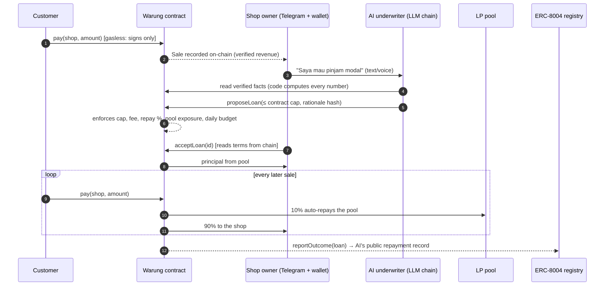
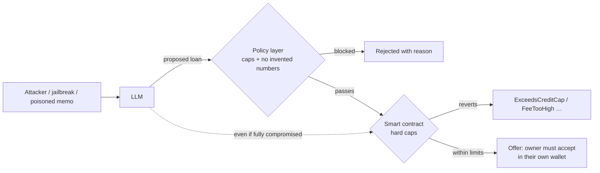

# Kulaya: hackathon submission text

Written for: the Indonesia Web3 Hackathon 2026 submission form (judges and organisers). Copy the sections the form asks for. Numbers are live testnet values as of Oct 6, 2026.

**Fill in before submitting:** team names and roles (section 9). Everything else is final.

---

## 1. Name, tagline, one-liner

- **Project:** Kulaya
- **Tagline (Bahasa):** Modal usaha, dari hasil jualan sendiri.
- **Tagline (English):** Credit that grows from every sale.
- **One line (≤ 140 chars):** AI micro-credit for Indonesia's small shops: every QR sale becomes an on-chain record, and the AI proposes loans that the smart contract enforces.
- **Pitch (≤ 280 chars):** Indonesia has 64 million small shops with no records a bank trusts, so they borrow from predatory pinjol. Kulaya turns every QR sale into a record the shop owns. An AI offers a small loan, the loan repays itself from sales, and the contract, not the AI, has the final word.

## 2. Tracks

AI Agents · Finance & Commerce · Consumer Apps

- **AI Agents:** an LLM underwriter with an ERC-8004 on-chain identity and public repayment reputation. Its key can only call `proposeLoan`, it holds no funds, and four independent layers keep it from hurting anyone even if it is jailbroken.
- **Finance & Commerce:** revenue-based micro-credit: limit = 10% of verified 30-day sales, capped by shop level, repaid automatically as a share of each sale. No collateral, no due date, no collectors.
- **Consumer Apps:** a Bahasa-first, gasless owner app and Telegram bot (text and voice) designed for shop owners aged 35-60, plus a customer pay page that needs no wallet to try.

## 3. Links

| | |
|---|---|
| Live app (owner site, Bahasa) | https://kulaya.vercel.app |
| Judge / developer site (English) | https://kulaya.vercel.app/protocol |
| Try to break the AI | https://kulaya.vercel.app/protocol/redteam |
| Demo video (3 min) | https://youtu.be/mTLAuLq-RCg |
| Source code | https://github.com/ketutezraugm/kulaya |
| Telegram bot | https://t.me/KulayaBot |
| Core contract (BNB Smart Chain testnet) | `0xF6fD0727D20eD76442BfD16727fA4ce1482321D8` |
| ERC-8004 agent | #2535 (wallet `0xA13B769d9b9777d49f73491379007dc4C2A1dc78`) |

Network: **BNB Smart Chain Testnet (chain id 97)**. Test money only.

## 4. The problem

Most Indonesian warung owners and small sellers have no formal credit history because they have no records a bank can trust. When they need stock money they turn to *pinjol*, predatory online lenders: interest that compounds, debt collectors who call family members, access to the borrower's contacts. Their real asset, a steady record of daily sales, is invisible to lenders because it lives in a notebook or in cash.

## 5. The solution

Kulaya turns everyday QR payments into a **tamper-proof, shop-owned revenue record on BNB Chain**, then uses an AI underwriter to offer **collateral-free micro-loans from a public pool**. The loan repays itself as a small share of every sale.

1. **Sell:** customers scan a QR and pay in an IDR stablecoin. They only sign: a relayer pays the network fee (gasless). Every payment is recorded on-chain.
2. **Build credit:** the shop's limit is 10% of verified 30-day sales, capped by its level (Rp 1 jt, 2 jt, 4 jt, 8 jt, doubling after each repaid loan). It takes at least 5 different customers, and one customer counts for at most Rp 250.000 per day, so fake sales don't help.
3. **Get an offer:** the owner just asks the AI (text or voice note on Telegram, or in the app). The AI reads verified sales and proposes terms. Code, not the AI, computes every number.
4. **Decide:** the owner sees exactly what they will repay, **read from the contract, not from the chat**, and accepts with one free signature.
5. **Repay by selling:** a fixed share of each sale (about 10%) repays the pool automatically. No due date, no late fees, no collectors. A slow week just means slower repayment.
6. **Reputation:** when a loan closes, the shop's level rises and the AI's repayment record is published on-chain through ERC-8004.

## 6. Why the AI can't hurt anyone

LLMs hallucinate and can be jailbroken, so **nothing the AI says is trusted**. Safety does not depend on the model behaving. Four independent layers:

1. **The AI key can only call `proposeLoan`** and holds no funds. Accepting a loan needs the owner's own signature.
2. **Hard caps in the contract:** loan ≤ 10% of trailing verified revenue and ≤ the level ceiling; fee ≤ 5%; ≤ 20% of each sale; per-loan ≤ 5% of the pool; a daily lending budget; ≥ 5 distinct customers; per-customer daily cap.
3. **The LLM never writes numbers.** Its explanation is a template with `{{placeholders}}`; code fills in real figures. Any stray digit rejects the proposal.
4. **Reply guard:** every figure in the AI's final message must already appear in a tool result, otherwise the model must rewrite.

**Attack it yourself** at `/protocol/redteam`: jailbreak the AI, poison a payment memo, or assume the model is fully compromised and hand its raw tool call to the safety layers. Asking for Rp 1.000.000.000 is blocked by the policy layer; switch that layer off and the contract still rejects it with `ExceedsCreditCap`. The console is a simulation against the live contract: nothing is broadcast.

## 7. Why it needs web3

| Piece | Why it must be on-chain |
|---|---|
| IDR stablecoin payments | A near-zero-fee rail where sales are natively visible to lenders |
| `Sale` events | A revenue history the shop owns and any lender can verify, with no bank gatekeeper |
| Auto-repayment split | Repayment enforced by code instead of collectors |
| Permissionless pool | Anyone can fund local shops; every loan and repayment is public |
| ERC-8004 agent identity + reputation | The AI underwriter has a public, unforgeable track record (the registry rejects self-reviews, so only real loan outcomes count) |

## 8. What is built and working (verify in two clicks)

- **Contracts (Foundry, 33 tests):** `Warung.sol` (revenue record, credit limit, loans, auto-repayment, pool with first-loss reserve, relayed EIP-712 actions), `ReputationAdapter.sol` (posts outcomes to ERC-8004), `MockIDRX.sol` (testnet stand-in).
- **App (Next.js on Vercel, 32 unit tests):** owner site in Bahasa (setup, home, receive payments with live "payment received", credit limit and loan offers, history, AI chat, help, public shop page, printable QR poster) and the English judge site `/protocol` (overview, red-team console, agent identity, lending pool, contracts, gasless, run-it-yourself).
- **Telegram bot:** chat, voice notes, QR creation, loan offers, one-tap login.
- **Gasless:** register, pay and accept-loan are all signature-only; a relayer pays the gas, and the contract only moves value to exactly what was signed.
- **End-to-end tests:** live API checks plus real-browser journeys (setup, payment, AI chat, loan offer, accept), all passing on production.
- **Real on-chain loan cycle:** the AI proposed Rp 800.000, the shop accepted, 50 customers' payments auto-repaid it, the loan closed, and the AI's ERC-8004 record reads **1 loan, 100/100**.
- **Live network (testnet, Oct 6, 2026):** 29 shops registered, 7 loans proposed, pool about Rp 100 jt of test IDRX.

To verify: open the contract on BscScan (link above), the AI agent page `/protocol/agent` (identity and reputation read from the registries), or `/protocol/contracts` (all addresses and live parameters).

## 9. Team

> **Fill in:** names, roles, and links (GitHub / LinkedIn / X) for each member. Suggested format: *Name: role, one line about what they built.*

## 10. Honest limits (we state these on screen too)

- **Testnet only.** The stablecoin is a mock (MockIDRX). There is no real money.
- **The payment QR is not QRIS.** OVO, GoPay and bank apps cannot scan it yet. Customers pay with a crypto wallet, or try the built-in demo wallet.
- **No real pilot yet.** The demo shop's customers are seeded wallets.
- **Real lending needs a licence.** The production path is a licensed lender of record (an OJK-licensed P2P lender or koperasi, via the OJK sandbox).
- **Anti-fraud is parameter-based** (per-customer daily cap, minimum payment, ≥ 5 distinct customers, the AI's fraud flag can only lower limits). A production system would add identity checks.

## 11. Roadmap

1. **QRIS bridge:** the shop shows a QRIS code from a licensed payment provider; customers pay in rupiah with their usual app; the provider settles IDRX into the contract, so the revenue record, the AI and its limits stay unchanged.
2. A licensed lending partner and the OJK regulatory sandbox.
3. Mainnet deployment with real IDRX.
4. Embedded wallets and a paymaster (e.g. MegaFuel) so owners never see a wallet at all.

## 12. Tech stack

Solidity 0.8.28 · Foundry · OpenZeppelin 5 · ERC-8004 · EIP-712 / EIP-2612 · viem · BNB Smart Chain testnet · Next.js 16 (App Router) on Vercel · Upstash Redis · Groq / Cerebras / Mistral / OpenRouter / Gemini free-tier LLMs with automatic failover · grammY (Telegram) · WalletConnect (Reown) · Playwright.

## 13. Try it in two minutes (for judges)

1. Open https://kulaya.vercel.app/protocol/redteam and press **Run simulation** with "Model compromised": watch the policy layer block a Rp 1 miliar loan; tick "Disable off-chain policy layer" and run again: the contract itself reverts.
2. Open the demo shop's payment page https://kulaya.vercel.app/bayar/0x7FeaeE8CFcC8D0E79329A864Fcf9758F4DDd98C6?amount=25000 and press **Coba dengan dompet demo**: a gasless payment is made with a throwaway test wallet. The transaction link is on the receipt.
3. Open https://kulaya.vercel.app/protocol/agent to read the AI's on-chain identity and reputation.

## 14. Short versions (for small form fields)

- **100 words:** Kulaya gives Indonesia's small shops credit that grows from every sale. Customers pay by QR, gaslessly, in an IDR stablecoin, so each sale becomes a tamper-proof record the shop owns on BNB Chain. An AI underwriter (ERC-8004 identity, public reputation) offers a small collateral-free loan; the owner sees terms read from the contract and accepts with one signature. The loan repays itself from a share of each sale: no due date, no collectors. The AI can only propose; hard caps in the smart contract decide, and you can attack it live on our red-team console. Bahasa-first app and Telegram bot. Testnet prototype.
- **What problem does it solve (≤ 50 words):** Small shops can't prove their income, so they borrow from predatory pinjol. Kulaya turns QR sales into a verifiable on-chain record and offers fair, auto-repaying micro-loans.
- **What's next (≤ 50 words):** A QRIS bridge through IDRX so any e-wallet can pay, a licensed lending partner via the OJK sandbox, mainnet, and embedded wallets so owners never see crypto.
